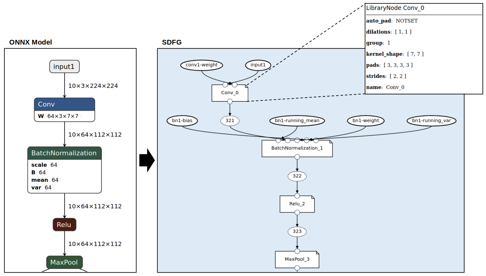

[](https://codecov.io/gh/spcl/daceml)
[](https://daceml.readthedocs.io/en/latest/?badge=latest)

# DaCeML

*Machine learning powered by data-centric parallel programming.*

This project adds PyTorch and ONNX model loading support to [DaCe](https://github.com/spcl/dace), and adds ONNX
 operator library nodes to the SDFG IR. With access to DaCe's rich transformation library and
productive development environment, **DaCeML can generate highly efficient implementations that can be executed on CPUs, GPUs
and FPGAs.**

The white box approach allows us to see computation at **all levels of granularity**: from coarse operators, to kernel
implementations, and even down to every scalar operation and memory access.



*Read more: [Library Nodes](https://daceml.readthedocs.io/en/latest/overviews/onnx.html#library-nodes)*
## Integration
Converting PyTorch modules is as easy as adding a decorator...
```python
@dace_module
class Model(nn.Module):
    def __init__(self, kernel_size):
        super().__init__()
        self.conv1 = nn.Conv2d(1, 4, kernel_size)
        self.conv2 = nn.Conv2d(4, 4, kernel_size)

    def forward(self, x):
        x = F.relu(self.conv1(x))
        return F.relu(self.conv2(x))
```
... and ONNX models can also be directly imported using the model loader:
```python
model = onnx.load(model_path)
dace_model = ONNXModel("mymodel", model)
```

*Read more: [PyTorch Integration](https://daceml.readthedocs.io/en/latest/overviews/pytorch.html) and 
[Importing ONNX models](https://daceml.readthedocs.io/en/latest/overviews/onnx.html#importing-onnx-models).*

## Training
DaCeML modules support training using a symbolic automatic differentiation engine:
```python
import torch.nn.functional as F
from daceml.pytorch import dace_module

@dace_module(backward=True)
class Net(nn.Module):
    def __init__(self):
        super().__init__()
        self.fc1 = nn.Linear(784, 120)
        self.fc2 = nn.Linear(120, 32)
        self.fc3 = nn.Linear(32, 10)
        self.ls = nn.LogSoftmax(dim=-1)

    def forward(self, x):
        x = F.relu(self.fc1(x))
        x = F.relu(self.fc2(x))
        x = self.fc3(x)
        x = self.ls(x)
        return x

x = torch.randn(8, 784)
y = torch.tensor([0, 1, 2, 3, 4, 5, 6, 7], dtype=torch.long)

model = Net()

criterion = nn.NLLLoss()
prediction = model(x)
loss = criterion(prediction, y)
# gradients can flow through model!
loss.backward()
```

*Read more: [Automatic Differentiation](https://daceml.readthedocs.io/en/latest/overviews/autodiff.html)*.

## Library Nodes
DaCeML extends the DaCe IR with machine learning operators. The added nodes perform computation as specificed by the
ONNX specification. DaCeML leverages high performance kernels from ONNXRuntime, as well as pure SDFG implementations
that are introspectable and transformable with data centric transformations.

The nodes can be used from the DaCe python frontend.
```python
import dace
import daceml.onnx as donnx
import numpy as np

@dace.program
def conv_program(X_arr: dace.float32[5, 3, 10, 10],
                 W_arr: dace.float32[16, 3, 3, 3]):
    output = dace.define_local([5, 16, 4, 4], dace.float32)
    donnx.ONNXConv(X=X_arr, W=W_arr, Y=output, strides=[2, 2])
    return output

X = np.random.rand(5, 3, 10, 10).astype(np.float32)
W = np.random.rand(16, 3, 3, 3).astype(np.float32)

result = conv_program(X_arr=X, W_arr=W)
```

## Setup
The easiest way to get started is to run

    make install
    
This will setup DaCeML in a newly created virtual environment.

*For more detailed instructions, including ONNXRuntime installation, see [Installation](https://daceml.readthedocs.io/en/latest/overviews/installation.html).*

## Development
Common development tasks are automated using the `Makefile`. 
See [Development](https://daceml.readthedocs.io/en/latest/overviews/development.html) for more information.
